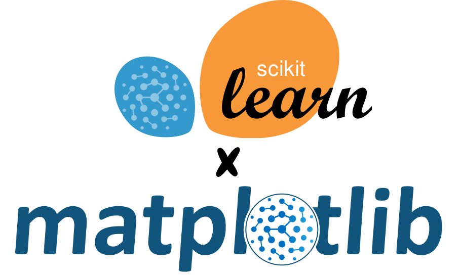

<h1>Welcome to the Brane Matplotlib package 👋</h1>
<p>
  
  <a href="#" target="_blank">
    
  </a>
</p>

This repository is the main repository of the BraneScripts created by the three J's.
We have created two Brane packages: 
(1) A [Dataprocessing package](https://github.com/tomwassing/brane-scikit-learn) using the scikit-learn library,
(2) A [Visualisation package](https://github.com/tomwassing/brane-matplotlib) that can visualise the results of the dataprocessing package.
The two packages can be imported using the following commands:

```sh
# Dataprocessing package
brane import tomwassing/brane-scikit-learn

# Visualisation package
brane import tomwassing/brane-matplotlib
```

## Author

👤 **Jurre J. Brandsen, Sander J. Misdorp, Tom J. Wassing**

* Github: [@JurreBrandsen1709](https://github.com/JurreBrandsen1709)
* Github: [@TomWassing](https://github.com/tomwassing)
* Github: [@SanderJan2](https://github.com/SanderJan2)

## Show your support

Give a ⭐️ if this project helped you!
